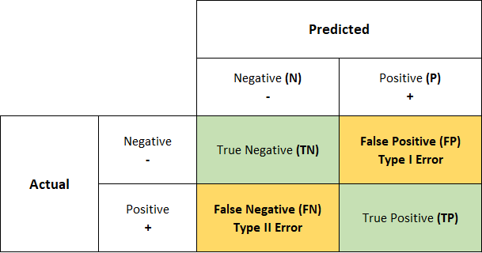
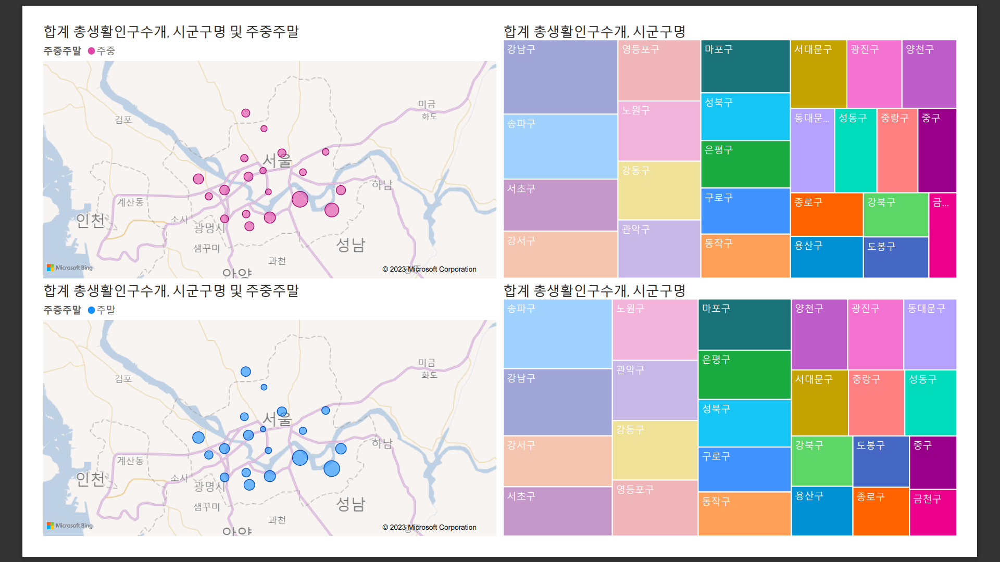

# BigLeader_9-----------
-------------------------
--------------------------
--------------------------
### 9조 빅리더 팀 스터디

- [0627 - Python(EDA, Crawling)](https://github.com/JHyuk2/BigLeader_9/tree/main/0627%20Python)

- [0628 - Power BI](https://github.com/JHyuk2/BigLeader_9/tree/main/0628%20Power%20BI)

- [0629 - Git Bash](https://github.com/JHyuk2/BigLeader_9/tree/main/0629%20Git%20Bash).

- [0630 - Crawler](https://github.com/JHyuk2/BigLeader_9/tree/main/0630%20Crawling)

  - Selenium

  - BeautifulSoup4

    

- 0717 - Machine Learning

  https://www.kaggle.com/code/jonghyuk/company-bankruptcy-prediction-transcription

  `Kaggle - Company Bankrupt prediction` 

  

  - Preprocessing

    - EDA

      - Null check
      - scaling - MinMax Scaler, Standard Scaler
      - imputation - SimpleImputer

    - Feature Selection and VIF (Variance Inflation Factor)

      - (Ensemble)model.feature_importances_

    - oversmapling_SMOTE, undersampling,

      

  - Modeling

    - DecisionTree
    - RandomForest
    - KNN (K-Nearest Neghibors)
    - LogisticRegression
    - LGBM - light GBM

  - Hyperparameter Tuning

    - GridSearchCV

    

  - Evaluate

    - confusion matrix / ConfusionMatrixDisplay

      - accuracy (TP + FP / TP + FP + TN + FN)  - 정확

      - precision (TP / TP + FP ) - 정밀도

      - recall (TP / TP + FN )  - 재현율

      - f1 score (2 /  (1/ precision + 1 /recall) ) - 조화 평균

      - ROC-AUC curve (transform shape of PDF under threshold's changing)

        (precision - recall trade off)
    
     
    
    

  

  

- [0724 - 0728 NLP](https://github.com/JHyuk2/BigLeader_9/tree/main/0724%20NLP)

  - day1 - konlpy, nltk, regexp
  - day2 - N-gram, TF-IDF / TDM , CountVectorizer, Cosine/Jacaard-similarity
  - day3 - Back propagation, categorical value, loss function and optimizer
  - day4 - tensorflow ~ Tokenizer, padding / LSTM, 
  - day5 - nltk ~ sent_tokenize, Word2Vec(gensim), SimpleRNN 

### 팀원 소개

- ##### 이종혁

  - 경영을 등진 경영학과
  - 든든한 맏형
  - 스몰리더 및 바지조장
  - ML/DL ~ 얕고 넓은 지식풀 보유
  - 이혜민의 두 번째 아빠
  - 친절킹 척척박사

- ##### 나윤정

  - 전자공학과
  - 나주나씨의 대들보
  - 데분계의 유망주
  - 9조의 든든함 담당
  - 참지 않는 니니

- ##### 나현호

  - 컴공과(늘 집에 가고 싶어함)
  - 테니스/배드민턴 동호회
  - ML/DL
  - 예민하지만 내 입술... 따뜻한 커피처럼(...샵)
  - 형한테만 애교쟁이

- ##### 이혜민

  - 통계학과
  - 폭풍성장 막내
  - 막내온탑
  - 통계기반 분석
  - 부산 사투리 소녀
  

## 6월 27일 화요일

#### `Python - EDA & Crawling`

**혜민**  
판다스와 크롤링을 배웠다. 크롤링 하는 건 처음이라 어려움이 많았다. 
정규수업에서 못 따라간 부분을 스터디에서 복습하니까 정확하게 이해되었다. 
 

**현호** 
시각화는 접해보지 않은 부분이라 신기했다. seaborn이 확실히 깔끔하고 좋은듯 
 

**종혁** 
판다스와 크롤링 과정을 통해 데이터 처리 기본을 알 수 있어 좋았다.  
특히 셀레니움과 웹드라이버에서 path설정을 하지 않아도 되는 것은 놀라운 변화였던 것 같다.   

 

**윤정**  

크롤링이 익숙하다고 생각했는데 여러 전처리 과정에 있어서 새로운 것을 많이 깨달았던 것 같다. 
 

## 6월 28일 수요일

#### `Power BI` 를 활용한 시각화

**혜민** 

> power bi는 처음 사용법이 조금 어려웠지만 익숙해지니 시각화가 편한 것 같다. 좀 재밌는 듯??

 

**현호** 

> 처음들어보는 툴에 처음해보는 작업이라 수업시간엔 따라가기 정말 힘들었다. 신기하고 예쁘긴 한데 몇번 쓰면 힘들어서 못쓸듯...

 

**종혁**  

>  PowerBI 매우 생소했고, 재밌었다. 하지만 역시 내 맘대로 데이터를 컨트롤하는게 힘들어서 그런지 자주 쓸 것 같진 않은 느낌이다.

 

**윤정** 

> 파이썬에서 matplot으로 쓰던 시각화를 다른 툴을 이용해서 나타내는게 재미있었다. 
> 특히 시간을 축으로 한 차트에서 예측하는 부분이 가장 신기했던것 같다. 

 

 

> Power BI 를 활용한 서울시내인구 주중,주말 인구통계 시각화
>
>  

## 6월 29일 목요일

#### `GIT` 사용법

**혜민** 

git add . - git commit(-m "메세지 보내는 곳") - git push   
복잡한데 계속 해야 완벽 이해 가능할 듯!!!  세미 이해함
 

**종혁** 

power BI - day2 / git bash 사용법 / 다들 화이팅!!  
 

**윤정** 

power BI 사용법 익히기!! 
git bash 처음써보는데 익히자  
 

**현호** 

Power BI 마무리 + git 자습 했다. Git bash 오랜만에 쓰니까 명령어도 기억안나고 개빡셈. 살려줘ㅓㅓㅓ 
Power BI 끝나서 좋아용
 

## 6월 30일 금요일

#### `Crawling` - Day 1

**혜민** 
미아내 늦게 써서~ ㅜㅜ 
오늘 크롤링 끄읏~!~!~!~! 다시 한 번 더 해봐야 할 듯 흑흑  

**종혁**   
개인적으로 들었던 강의 중 가장 깔끔했던 강의 중 하나.  
타겟을 정하고. What Why How Get. 기억하자  
 

**윤정** 
크롤링 익숙하고도 새로운 것 중 하나인데, 인터넷이 안되서 수업을 제대로 듣지 못해서 아쉬웠다. 
beautifulsoup 쓰지 않고 selenium 으로만 쓰기 
그건 내 고집이야야 

 

**현호** 

Selenium과 Chrome webdriver를 이용한 웹 크롤링을 배운지 1일차. 써먹을 일이 있었는데 잘 됐다. 

## 7월 3일 월요일

#### `Tableau` - Day 1

**혜민** 

 흠 괜찮게 시각화를 했다고 생각했는데 다른 사람 시각화 한 거 보면 생각도 못 해본 시각화를 하고...!!! 
 모자라군... 근데 난 전처리하는 것도 더 공부해야 할 듯. 

**종혁**   

> 시각화의 목적은 일반인들에게 데이터를 쉽게 설명해주는 것...이지만  
> 마냥 쉽지만은 않은 것 같다. 그동안 시각화에 대한 내 시야가 좁았던 것 같다는 생각이 든다.    
>
> 

 

**윤정** 

> power bi보다 미적으로 시각화 되는 범위가 적은 것 같다는 생각이 들었다. 
> 그래서 생각했던 이미지로 나타내는 게 어려웠다. 
> 또, 사용하는 방법도 어려워서 나중에 혼자 사용하기 힘들거 같다. 

 

**현호** 

> PBI보다 더 어렵고 제한적인것 같음... 진짜 너무너무 귀찮아서 차라리 PBI를 쓸듯. 이런게 분석을 시각화하는건 좋은데 쓰는게 참... 대시보드만 만들거면 피그마 쓸듯  
>  

## 7월 4일 화요일

#### `Tableau` - Day 2

**혜민**

> 파워비아이랑 헷갈림 둘이  거기서 거기같은데... 
> 그래도 처음보단 아무것도 모르는 정도는 탈출한 듯  

**윤정** 

> 하나의 엑셀 파일에서 여러 시 트를 한번에 불러오면 연동해야 한다? 
> 파워 비아이보다 원본데이터에 대한 쿼리(?)편집이 어렵고, 형 변환도 매번 걸리는 문제라 불편했다.
>
>  

**종혁** 

>  시각화에 대해 소홀했던  나에 대한 반성.

 

 
**현호** 

> PBI에 비해 자유도도 낮고 선택의 폭이 좋은것이 장단점인듯. 이것도 막 잘 쓸것 같지는 않다.

 

## 7월 5일 수요일

#### `RPA` - Day 1

**윤정**  

> 이론으로 들었을때는 웹 크롤링과 머신러닝을 합친 프로그램이라고 생각했는데  
주소를 적어오는 파이썬 크롤링과 달리 더 편리하다고 생각했는데   
구성도, 변수설정과 액티비티 연결도 헷갈리고 어려웠다.  
원하는 바를 이미지로 떠올렸을때 크롤링으로는 어떻게 해야할지 감이 오는데  
uipath는 어떻게 해야할지 감이 잘 안잡힌다.  

 

**종혁**  
> 쓸만하다고 생각했는데 못써먹겠다. gg 익숙하지 않아서 더 별로였다. 

 

** **

 

** **

**혜민**   

>나 프로그램.... 안 돼서 못 함....ㅠㅠ  브라우저가 왜 안 되는 것일까요?  
그래도 브라우저 빼고는 배울 수 있었던 게 많았다

 

**현호**   
RPA를 배우면서 느낀점. 노코드는 내 취향도 아니고 잘 못하겠다. 남들한테 알려줄 정도로만 배워야지...
 

## 7월 17일 수요일

#### `ML` - Day 1

 
**혜민**
예전에 배웠던 거랑 뒤죽박죽 돼서 더 헷갈렸다
아주주주 어렵다!!!

**윤정** 
>우리 얼마나 오랫동안 안쓴걸까.. SQL은 모두 건너 뛰어버렸네,, 
지난주는 평일 5일중에 특강있는 하루 빼고 4일 내내 시험보느라 모두 정신이 없었나보다.. 
그래요 우리팀원들 수고했어,, 
>머신러닝 첫번째 수업은.. 아는거라 거의 안들었지만 무슨 말을 하고픈지 모르겠는 교수님 수업이 난해했다..^^; 
XGBoost는 무겁고 느리기 때문에 LightGBoost를 쓴다고 했다. 이 모델 이전에는 그리드 서치를 이용해

최적화인 파라미터를 정할 수 있다. 이게 맞나.. 

**종혁**  

> 나는 오렌지가 싫다.

**현호**  

> 오렌지? 오렌지? 오렌지? 오... 나는 수학이 좋은 사람이였다...

## 7월 20일 목요일

#### `ML` - Day 4

 
**윤정**
> SST= SSE + SSR 
TOTAL = 예측값(회귀선)과 실제값 차이 + 실제값의 평균과 예측값(회귀선)의 차이 
라쏘( 제1규제 ) : 유효한 여러 피처 중 일부를 랜덤으로 선택 
릿지( 제2규제 ) : 피처의 상관성?을 정규화하여 가중치를 설정 
=> 라쏘는 가중치가 0이 되어 없어지는 피쳐가 있고, 릿지는 가중치가 0에 가까워 지는 원리임으로 없어지는 것은 아님 

elastic : 라쏘와 릿지 모두 사용하는 모델

**현호**  

> 이제 ML1주차 끝이 보인다. 모르는 용어가 생각보다 많아서 열심히 공부는 했는데 아직 어렵다. Preprocessing은 어렵다.

## 7월 24 - 28일

#### `NLP` - Day 1

**종혁**  

> 7월이 벌써 끝나간다. 한달동안 나는 무엇을 했을까 돌아보는 시점. 
>
> 수업이 자연어처리와 딥러닝이라 그랬을까 나는 아직도 부족하고 모르는게 많다고 느꼈던 시간이었던 것 같다. 열심히가 아니라 잘 하고 싶다. 조금만 다시 힘내보자. 우리조 화이팅!

